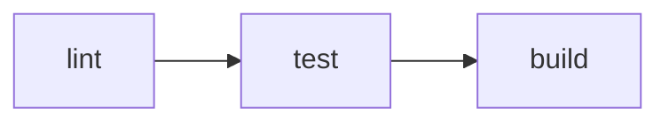

# CI/CD

## Objetivos
- Reproducible: Node 20 + pnpm via `pnpm/action-setup`.
- Rápido: cache del _store_ de pnpm.
- Inteligente: **path filters** para ejecutar sólo lo necesario.
- Trazable: artefactos de `dist/`.

## Triggers
- `push` y `pull_request` a `main` + `workflow_dispatch` manual.
- Concurrency para evitar jobs superpuestos:
```yaml
concurrency:
  group: ci-${ github.ref }
  cancel-in-progress: true
```

## Instalación y cache (extracto del workflow)
```yaml
- uses: actions/setup-node@v4
  with:
    node-version: '20'

- uses: pnpm/action-setup@v4
  with:
    run_install: false

- name: Verify pnpm
  run: |
    which pnpm
    pnpm -v

- name: Resolve pnpm store path
  id: pnpm-cache
  run: echo "STORE_PATH=$(pnpm store path)" >> $GITHUB_OUTPUT

- name: Setup pnpm cache
  uses: actions/cache@v4
  with:
    path: ${{ steps.pnpm-cache.outputs.STORE_PATH }}
    key: ${{ runner.os }}-pnpm-${{ hashFiles('**/pnpm-lock.yaml') }}
    restore-keys: |
      ${{ runner.os }}-pnpm-
```

## Pipeline (lint → test → build)



- **lint** ejecuta `pnpm -r lint` para todos los workspaces, manteniendo visible que aún son placeholders.
- **test** ejecuta `pnpm -r test`; se corta la ejecución si alguna app falla.
- **build** compila backend/admin/client con los mismos comandos que usamos localmente.
- `pnpm install --frozen-lockfile` dispara `prisma generate` vía `postinstall`, asegurando Prisma Client actualizado en cada job.

Si un job falla, el merge se bloquea porque `main` exige el check **CI** en verde. Podés reintentar con **Re-run jobs** (GitHub UI) o pusheando un fix a la rama.

## Path filters por workspace (opcional)
```yaml
- uses: dorny/paths-filter@v3
  id: filter
  with:
    filters: |
      backend:
        - 'apps/backend/**'
      client:
        - 'apps/client/**'
      admin:
        - 'apps/admin/**'
      tooling:
        - '.github/**'
        - 'pnpm-lock.yaml'

- name: Build backend
  if: steps.filter.outputs.backend == 'true' || steps.filter.outputs.tooling == 'true'
  run: pnpm -F backend build

- name: Build client
  if: steps.filter.outputs.client == 'true' || steps.filter.outputs.tooling == 'true'
  run: pnpm -F client build

- name: Build admin
  if: steps.filter.outputs.admin == 'true' || steps.filter.outputs.tooling == 'true'
  run: pnpm -F admin build
```

## Artefactos de build
```yaml
- uses: actions/upload-artifact@v4
  with:
    name: client-dist
    path: apps/client/dist
- uses: actions/upload-artifact@v4
  with:
    name: admin-dist
    path: apps/admin/dist
```

## Gates y environments (staging/prod)
- Crear **Environments** en _Settings → Environments_: `staging`, `production`.
- Agregar gates (aprobación manual) y secretos por entorno.
- Job `deploy` condicionado a `environment` y a que el build esté verde.

## Reglas de protección de rama
- _Settings → Branches → Add rule_ para `main`:
  - PR obligatorio
  - Required status checks: **CI**
  - (Opcional) Require linear history

## Secretos
- **Actions → Secrets and variables → Actions** por entorno.
- Nunca almacenar secretos en el repo.

## Categorías — consideraciones específicas

- Cambios en `/docs/` solamente no disparan builds adicionales, pero es obligatorio validar que diagrams Mermaid y JSON sean válidos antes del PR.
- `pnpm -r test` ejecuta las suites de categorías (API + RBAC); si fallan bloquean el job `test`.
- Pre-check recomendado localmente:
  - `pnpm -r lint:docs` (si existe) o, en su defecto, `pnpm -F docs lint` para validar Markdown (cuando esté disponible).
  - `npx @mermaid-js/mermaid-cli` o [Mermaid Live](https://mermaid.live) para asegurar que los nuevos diagramas compilan.
  - `python -m json.tool docs/06-apis/postman_collection.json` para garantizar JSON válido.
- Para seeds consistentes en CI preview, ejecutar `pnpm -F backend prisma:migrate:deploy` seguido de `pnpm -F backend db:seed` (crea permisos `categories:r/w/u/d`).
- > NOTE: Si se agrega soft-delete o conteo de productos, actualizar scripts de seeds y smoke tests antes de habilitar nuevos checks.
